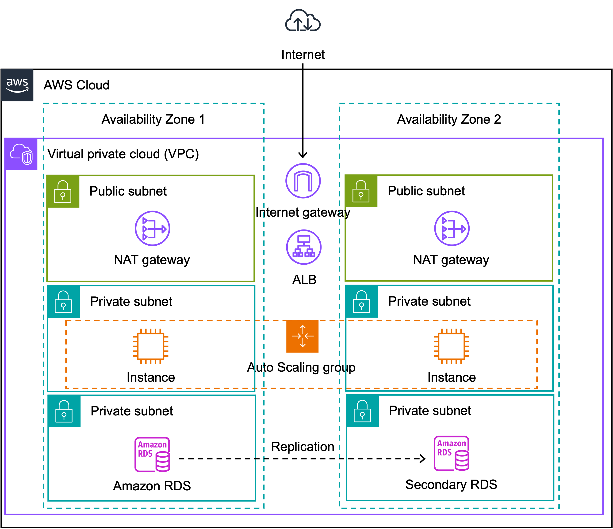

# AWS 3-Tier Architecture

AWS 3계층 아키텍처는 웹 애플리케이션을 설계하고 구축하는 데 사용되는 전형적인 아키텍처 패턴입니다. 이 아키텍처는 사용자 요청을 처리하기 위해 세 개의 서로 다른 계층으로 나뉘어 있습니다.

1. **Presentation Layer**:
Presentation Layer 또는 Frontend Tier는 사용자와 상호 작용하는 부분으로, 일반적으로 웹 애플리케이션의 UI(User Interface)를 담당합니다. 이 계층은 클라이언트 측 기술 및 프레임워크로 작성된 웹 페이지를 제공하고 사용자의 입력을 수신합니다.

2. **Application Layer**:
Application Layer 또는 Logic Tier는 Presentation Layer에서 전달된 요청을 처리하고 비즈니스 로직을 수행하는 부분입니다. 일반적으로 이 계층에는 애플리케이션 서버, 애플리케이션 코드 및 데이터베이스 액세스 로직이 포함됩니다. 이 계층은 사용자 요청을 처리하고 데이터를 가져와 로직을 실행한 후 결과를 반환합니다.

3. **Data Layer**:
Data Layer는 애플리케이션의 데이터를 저장하고 관리하는 부분입니다. 이 계층은 일반적으로 데이터베이스와 관련된 서비스 및 데이터 스토리지 시스템을 포함합니다. 데이터베이스는 사용자 및 애플리케이션에서 필요한 데이터를 저장하고 검색하는 데 사용됩니다.

이러한 세 가지 계층은 각각의 역할을 분리하고 애플리케이션의 확장성, 유연성 및 보안을 향상시킵니다. AWS에서는 이러한 3계층 아키텍처를 구현하기 위해 다양한 서비스 및 리소스를 활용할 수 있으며, 예를 들어 Amazon EC2, Amazon RDS, Amazon S3, Amazon CloudFront 등을 사용할 수 있습니다.

